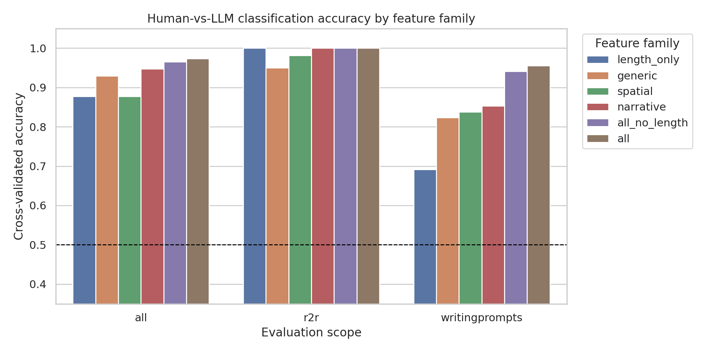
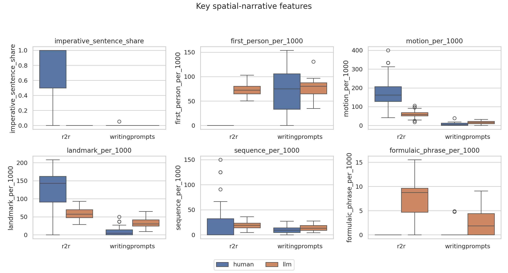
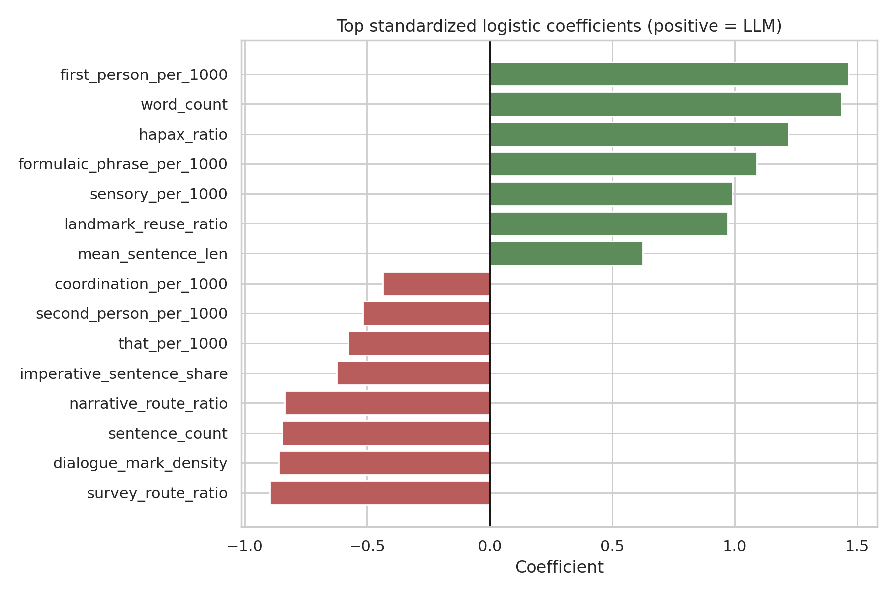

# Narrative Space in LLMs: Research Report

## 1. Executive Summary

This study tested whether LLM-generated stories about moving through built space show a measurable spatial-narrative grammar that differs from human spatial language. I built a balanced corpus of 114 human texts and 114 real GPT-5.4-mini generations: 80 R2R indoor route cases and 34 spatial WritingPrompts prose-control cases.

The main finding is positive but qualified. Human and LLM spatial texts were highly separable by engineered features: all features reached 97.4% cross-validated accuracy, all non-length features reached 96.5%, and spatial-only features reached 87.7% with permutation p = 0.0099. The smaller WritingPrompts control, where both sides are prose rather than route instructions, still showed 83.8% accuracy with spatial-only features and 94.1% with all non-length features.

Practically, the observed LLM pattern is not just "more words." GPT-5.4-mini tended to convert spatial movement into first-person embodied scenes with higher sensory language, formulaic phrases, repeated landmarks, and explicit route-like closure, while human R2R instructions were denser in imperatives and motion commands. The evidence supports a measurable LLM spatial-narrative fingerprint, but it should be treated as a feature profile under this prompting setup, not as proof of a stable cognitive map difference.

## 2. Research Question & Motivation

The hypothesis was: when LLMs are asked to write stories involving spatial navigation, such as moving through a building, they may diverge from human narrative patterns in systematic ways. The motivating idea is that there may be a "grammar" of LLM spatial narratives analogous to known LLM stylistic tics.

This matters because LLM spatial stories are used as synthetic data, interactive-fiction content, and sometimes as planning traces for embodied or simulated agents. If these texts encode spatial movement differently from human texts, they may be fluent but systematically biased in how they introduce landmarks, preserve route order, express perspective, and close movement sequences.

The literature review suggested a gap: R2R and related VLN datasets capture human indoor route language, while human-vs-LLM style studies capture broad linguistic differences, but little existing work directly measures human-vs-LLM differences in spatial narrative structure.

## 3. Experimental Setup

### Models Tested

- Model: `gpt-5.4-mini`
- API: OpenAI Responses API
- Parameters: temperature 0.7, max output tokens 320
- Generation count: 114 calls
- Token usage: 20,316 input tokens, 29,078 output tokens, 49,394 total tokens
- Estimated API cost: about USD 0.15 using official GPT-5.4-mini pricing of USD 0.75 per 1M input tokens and USD 4.50 per 1M output tokens. See the OpenAI GPT-5.4 mini model/pricing docs in References.

### Datasets

| Dataset | Role | Size used | Notes |
|---|---:|---:|---|
| R2R Navigation Instructions | Human route baseline | 80 routes, 80 human instructions | One instruction sampled per route; GPT generated one first-person story from route constraints. |
| WritingPrompts spatial sample | Human prose control | 34 prompt/story pairs | Used prompts whose prompt text had spatial or built-environment terms; human stories truncated to 220 words. |
| LongStory | External AI sanity check | 80 excerpts | Not used for training; scored with classifier trained on main corpus. |

### Prompts

R2R prompts asked GPT-5.4-mini to write a 160-220 word first-person micro-story preserving the order and stopping point of the route constraints. WritingPrompts prompts asked for a 160-220 word first-person story scene responding to the original prompt, centered on embodied movement through an indoor or built space when compatible.

Full prompt records are saved in `results/prompts/llm_prompts.jsonl`.

### Features

Feature extraction used transparent regex/count features rather than embeddings:

- Length/generic style: word count, sentence count, mean sentence length, lexical diversity, nominalization-like suffixes, `-ing` participials, coordination, `that`, passive-like forms.
- Spatial grammar: direction terms, cardinal/survey terms, egocentric terms, landmarks, motion verbs, sequence markers, deixis, route-step density, landmark reuse, left/right imbalance, closure, imperative sentence share.
- Narrative embellishment: first/second person, sensory terms, affect terms, formulaic phrases, and narrative-to-route ratio.

The implementation is in `src/features.py`.

### Statistical Plan

The preregistered plan in `planning.md` used:

- Mann-Whitney U tests as the primary feature-comparison test.
- Benjamini-Hochberg correction across planned feature comparisons.
- Cohen's d and Cliff's delta as effect sizes.
- Stratified 5-fold cross-validation for logistic-regression classifiers.
- Feature-family ablations: length-only, generic, spatial, narrative, all, and all-without-length.
- 100-label permutation tests for the aggregate spatial, all, and all-without-length classifiers.

### Compute Environment

- Python: 3.12.8
- Key packages: pandas, scipy, scikit-learn, statsmodels, matplotlib, seaborn, datasets, openai
- GPU availability: four NVIDIA RTX A6000 GPUs, each 49,140 MiB total memory
- GPU usage: no GPU computation was needed because this was API-based generation plus CPU feature analysis; no neural training batch size was used.
- Generation time: 114 API generations completed in 6 minutes 33 seconds.
- Reproducibility seed: 42

## 4. Results

### Corpus Balance

| Source | Human n | LLM n |
|---|---:|---:|
| R2R | 80 | 80 |
| WritingPrompts | 34 | 34 |
| Total | 114 | 114 |

### Classification Results

The strongest result was that non-length features were still highly predictive of author class.

| Scope | Feature family | Accuracy | F1 | ROC-AUC | 95% CV accuracy CI |
|---|---|---:|---:|---:|---:|
| All | length-only | 0.877 | 0.890 | 0.909 | 0.833-0.925 |
| All | spatial-only | 0.877 | 0.884 | 0.956 | 0.859-0.891 |
| All | narrative-only | 0.947 | 0.948 | 0.978 | 0.926-0.965 |
| All | all no length | 0.965 | 0.966 | 0.983 | 0.947-0.987 |
| All | all features | 0.974 | 0.974 | 0.997 | 0.951-0.991 |
| R2R | spatial-only | 0.981 | 0.982 | 1.000 | 0.956-1.000 |
| R2R | all no length | 1.000 | 1.000 | 1.000 | 1.000-1.000 |
| WritingPrompts | length-only | 0.691 | 0.696 | 0.820 | 0.609-0.753 |
| WritingPrompts | spatial-only | 0.838 | 0.841 | 0.891 | 0.729-0.957 |
| WritingPrompts | all no length | 0.941 | 0.943 | 0.958 | 0.925-0.971 |
| WritingPrompts | all features | 0.956 | 0.958 | 0.978 | 0.926-0.986 |

Permutation tests for the aggregate classifiers gave p = 0.0099 for spatial-only, all-without-length, and all-features. The p-value floor is set by 100 permutations.

### Key Feature Differences

Across the full corpus, GPT-5.4-mini outputs had much higher sensory language, formulaic phrases, first-person language, and landmark reuse. Human texts, especially R2R, had more imperative structure and a higher survey/route ratio.

| Scope | Feature | Human mean | LLM mean | Direction | BH q |
|---|---|---:|---:|---|---:|
| All | sensory_per_1000 | 1.77 | 14.67 | LLM higher | 5.41e-32 |
| All | formulaic_phrase_per_1000 | 0.08 | 6.09 | LLM higher | 5.46e-30 |
| All | survey_route_ratio | 0.252 | 0.065 | LLM lower | 5.09e-28 |
| All | imperative_sentence_share | 0.543 | 0.000 | LLM lower | 1.50e-24 |
| All | first_person_per_1000 | 20.53 | 74.21 | LLM higher | 1.62e-20 |
| All | landmark_reuse_ratio | 0.121 | 0.317 | LLM higher | 1.03e-14 |

The WritingPrompts prose-control produced the most relevant evidence against a pure route-instruction artifact:

| Feature | Human mean | LLM mean | Direction | BH q |
|---|---:|---:|---|---:|
| landmark_per_1000 | 9.79 | 32.92 | LLM higher | 4.62e-08 |
| sensory_per_1000 | 5.93 | 16.75 | LLM higher | 1.19e-07 |
| route_step_density | 43.55 | 64.90 | LLM higher | 8.33e-06 |
| motion_per_1000 | 7.81 | 16.92 | LLM higher | 7.06e-05 |
| formulaic_phrase_per_1000 | 0.28 | 2.79 | LLM higher | 1.96e-04 |
| survey_route_ratio | 0.289 | 0.117 | LLM lower | 5.60e-04 |

### Feature Importance

The top standardized logistic coefficients for predicting LLM authorship were:

| Feature | Coefficient |
|---|---:|
| first_person_per_1000 | 1.463 |
| word_count | 1.434 |
| hapax_ratio | 1.217 |
| formulaic_phrase_per_1000 | 1.089 |
| sensory_per_1000 | 0.991 |
| landmark_reuse_ratio | 0.972 |
| survey_route_ratio | -0.896 |
| dialogue_mark_density | -0.860 |
| sentence_count | -0.845 |
| narrative_route_ratio | -0.835 |

Positive coefficients indicate LLM-leaning features. Negative coefficients indicate human-leaning features in this model.

### External LongStory Check

A classifier trained on the main corpus predicted 43.8% of the 80 spatial LongStory excerpts as LLM, with mean LLM probability 0.412. This weak external transfer suggests the detected fingerprint is not simply "any AI story"; it is partly tied to the specific prompt, model, corpus genre, and spatial-navigation setup.

## 5. Analysis & Discussion

The results support the existence of a measurable LLM spatial-narrative profile under the tested conditions. The most interpretable pattern is that GPT-5.4-mini often turns navigation into an embodied, sensory, first-person passage: it repeats landmarks, adds atmosphere, uses formulaic scene beats, and reduces instruction-like imperatives. In contrast, human R2R language is terse, task-directed, and dense with motion commands.

The WritingPrompts control matters because it weakens the simplest alternative explanation. In that subset, length-only accuracy was only 69.1%, but spatial-only accuracy was 83.8% and all non-length features reached 94.1%. The LLM prose used more landmarks, movement verbs, route-step language, sensory language, and formulaic phrases than human prompt-matched prose excerpts.

The strongest caveat is that the R2R experiment deliberately asks an LLM to transform route instructions into first-person fiction. That creates a genre shift: human R2R texts are instructions, while LLM outputs are stories. The no-length and spatial-only ablations reduce but do not eliminate this confound. The WritingPrompts subset is closer to the target question, but it is small at 34 matched prompts.

The evidence therefore supports a cautious claim: there is a measurable "grammar" of LLM spatial narratives in this setup, but the present study cannot fully separate model-internal spatial representation from prompt style, genre, and instruction-following artifacts.

## 6. Limitations

- R2R is a route-instruction corpus, not a literary narrative corpus. Its perfect length-only separability shows a real genre confound.
- The WritingPrompts spatial subset contains only 34 prompt-matched examples after deduplication and prompt-term filtering.
- Only one current LLM, GPT-5.4-mini, was tested. The effect may differ for base models, other RLHF families, or smaller open models.
- The prompts requested first-person stories, so first-person effects partly reflect experimental instructions.
- Feature extraction is approximate and regex-based. It favors interpretability over parser-level precision.
- No human annotators judged spatial coherence, route validity, or narrative quality.
- API models can change over time; exact replication depends on continued availability of `gpt-5.4-mini`.
- The study does not prove that LLMs lack or possess spatial maps; it measures textual behavior.

## 7. Conclusions & Next Steps

The answer to the research question is yes, with qualifications: GPT-5.4-mini spatial narratives diverged from human spatial texts in measurable, interpretable ways. The clearest profile was a first-person, sensory, formulaic, landmark-reusing narrative style, plus lower use of imperative route-instruction grammar.

The next step should be a cleaner human-vs-LLM prose benchmark: collect human-written 160-220 word first-person building-navigation stories from the same prompts used for LLMs, then evaluate spatial graph consistency with human annotation. A second useful extension is multi-model testing across base, instruction-tuned, and RLHF/RLAIF models to determine whether the spatial grammar is model-family-specific.

## Reproduction Artifacts

- Plan: `planning.md`
- Code: `src/prepare_corpora.py`, `src/generate_llm_outputs.py`, `src/features.py`, `src/analyze_results.py`
- Prompts: `results/prompts/llm_prompts.jsonl`
- Human corpus: `results/human_corpus.jsonl`
- LLM outputs: `results/model_outputs/gpt-5.4-mini_outputs.jsonl`
- Feature table: `results/features.csv`
- Statistical tests: `results/evaluations/feature_tests.csv`
- Classifier metrics: `results/evaluations/classification_metrics.csv`
- Figures: `figures/classification_accuracy.png`, `figures/key_feature_distributions.png`, `figures/top_logistic_coefficients.png`

## References

- Anderson et al. 2018. Vision-and-Language Navigation: Interpreting visually-grounded navigation instructions in real environments. Downloaded as `papers/1711.07280_vision_language_navigation_r2r.pdf`.
- Fried et al. 2018. Speaker-Follower Models for Vision-and-Language Navigation. Downloaded as `papers/1806.02724_speaker_follower_vln.pdf`.
- Reinhart et al. 2024/2025. Do LLMs write like humans? Downloaded as `papers/2410.16107_llms_write_like_humans_styles.pdf`.
- Wu et al. 2024. Mind's Eye of LLMs: Visualization-of-Thought. Downloaded as `papers/2404.03622_visualization_of_thought_spatial_reasoning.pdf`.
- Wu and Deng 2025. Spatial Representation of LLMs in 2D Scene. Downloaded as `papers/wu_2025_spatial_representation_llms_2d_scene.pdf`.
- Xia et al. 2026. StoryAlign. Downloaded as `papers/2605.04831_storyalign_story_reward_models.pdf`.
- OpenAI. GPT-5.4 mini model documentation and pricing. https://developers.openai.com/api/docs/models/gpt-5.4-mini
- OpenAI. API pricing page. https://openai.com/api/pricing
